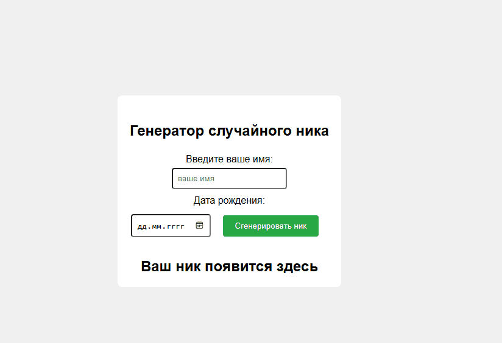

 Проект "Ник для игры"

# Описание проекта
Данный проект является генератором никнейма в игре.

# Цели проекта
Проект реализован создания игровых никнеймов.

# Используемые технологии
Для создания верстки сайта HTML5,
JavaScript для реализациии функции проекта,
CSS для стилизации сайта.

# Описание основных функций
`generateNickname()` - общая функция, создающая ник.

# Пример запуска
Для запуска проекта для начала вам необходимо его скачать после чего запустить файл index.html.

Проект выполнен в образовательных целях на онлайн-курсе "Основы Python" школы "Лидер".
